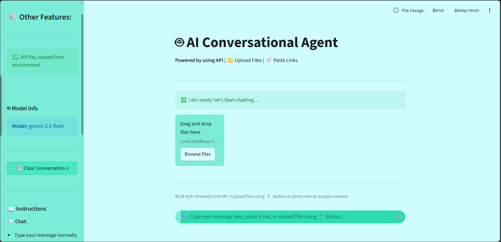

# 🤖 AI Conversational Agent

A simple yet powerful conversational AI agent powered by Google Gemini 2.5 Flash. Built with Streamlit for an intuitive chat interface.


## ✨ Features

- 💬 **Natural Conversations** - Chat naturally with AI that understands context
- 🧠 **Context Awareness** - Remembers conversation history for better responses
- 🎨 **Clean UI** - Simple and intuitive Streamlit interface
- 🔒 **Secure API Key Handling** - Environment variables or user input
- 🚀 **Easy Deployment** - One-click deploy to Streamlit Cloud
- 🗑️ **Clear History** - Reset conversations anytime

## 🎯 Demo

[Live Demo on Streamlit Cloud](YOUR_DEPLOYED_APP_URL_HERE)

## 📸 Screenshots


*Add your screenshot here after deployment*

## 🚀 Quick Start

### Prerequisites

- Python 3.8 or higher
- Google API Key ([Get one free here](https://makersuite.google.com/app/apikey))

### Local Installation

1. **Clone the repository**
```bash
   git clone https://github.com/YOUR_USERNAME/AGENTIC_RAG.git
   cd AGENTIC_RAG
```

2. **Install dependencies**
```bash
   pip install -r requirements.txt
```

3. **Run the app**
```bash
   streamlit run app.py
```


## 🔑 Getting Your Google API Key

1. Visit [Google AI Studio](https://makersuite.google.com/app/apikey)
2. Sign in with your Google account
3. Click "Create API Key"
4. Copy your API key
5. Use it in the app sidebar or set it as an environment variable

## ☁️ Deploy to Streamlit Cloud

1. **Fork this repository** or push to your GitHub

2. **Go to [Streamlit Cloud](https://share.streamlit.io)**

3. **Click "New app"**

4. **Configure deployment:**
   - Repository: `ArpanHait/AGENTIC_RAG`
   - Branch: `main`
   - Main file path: `app.py`

5. **Add your API key in Secrets:**
   - Go to app settings → Secrets
   - Add:
```toml
     GOOGLE_API_KEY = "your-api-key-here"
```

6. **Click Deploy!** 🚀

## 🛠️ Technology Stack

- **Framework:** [Streamlit](https://streamlit.io/)
- **AI Model:** Google Gemini 2.5 Flash Preview
- **Language:** Python 3.8+
- **Dependencies:** 
  - `streamlit` - Web framework
  - `google-generativeai` - Google AI SDK

## 📁 Project Structure
```
AGENTIC_RAG/
│
├── .streamlit/
│   ├── config.toml          # Streamlit configuration
│   └── secrets.toml         # API keys (local only, not in git)
│
├── app.py                   # Main Streamlit application
├── requirements.txt         # Python dependencies
├── README.md               # Project documentation
└── .gitignore              # Git ignore file
```

## ⚙️ Configuration

### Model Settings

You can modify the model settings in `app.py`:
```python
class AgentConfig:
    GEMINI_MODEL = "gemini-2.5-flash-preview-09-2025"
    MAX_HISTORY = 10  
```

### Generation Parameters
```python
generation_config={
    "temperature": 0.7,     
    "top_p": 0.95,        
    "top_k": 40,           
    "max_output_tokens": 2048,  
}
```

## 💡 Usage Tips

1. **Be Specific** - Clear questions get better answers
2. **Use Context** - The agent remembers previous messages
3. **Try Different Topics** - Ask about coding, writing, analysis, etc.
4. **Clear History** - Use the sidebar button to start fresh
5. **Experiment** - Test different conversation styles

## 🤝 Contributing

Contributions are welcome! Please feel free to submit a Pull Request.

1. Fork the repository
2. Create your feature branch (`git checkout -b feature/AmazingFeature`)
3. Commit your changes (`git commit -m 'Add some AmazingFeature'`)
4. Push to the branch (`git push origin feature/AmazingFeature`)
5. Open a Pull Request

## 📝 License

This project is licensed under the MIT License - see the [LICENSE](LICENSE) file for details.

## 🙏 Acknowledgments

- [Google Gemini](https://deepmind.google/technologies/gemini/) for the powerful AI model
- [Streamlit](https://streamlit.io/) for the amazing web framework
- The open-source community for inspiration

## 📧 Contact

Your Name - [@yourtwitter](https://twitter.com/yourtwitter) - your.email@example.com

Project Link: [https://github.com/YOUR_USERNAME/AGENTIC_RAG](https://github.com/YOUR_USERNAME/AGENTIC_RAG)

---

⭐ **Star this repo if you find it helpful!** ⭐

🙌 Made by Arpan using API 💖.